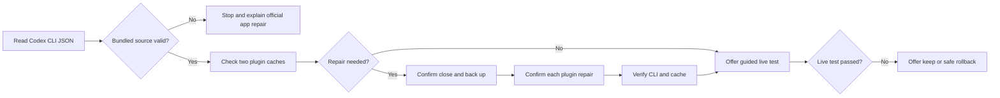

# Codex Bundled Repair

An independent, unofficial command-line helper for diagnosing and repairing `chrome@openai-bundled` and `computer-use@openai-bundled` in Codex Desktop on Windows and macOS.

The default command is read-only. It checks the staged source against the installed desktop package when that package can be located. When a plugin is missing, disabled, or its cached manifest differs from the installed bundled source, `--repair` offers a confirmed repair. It asks Codex Desktop to quit, backs up `~/.codex/plugins`, `config.toml`, and the global state file when present, then uses Codex's own `plugin add` command. It can move a damaged plugin cache into a reversible quarantine before reinstalling that plugin. It never takes ownership of WindowsApps, changes its permissions, or manually registers the reserved `openai-bundled` marketplace.

## Download and run

Download the ZIP for your platform from GitHub Releases and compare its SHA-256 value with `SHA256SUMS`. Both initial binaries are unsigned **previews**. Windows may show a SmartScreen warning. The macOS build has automated build and test coverage but no real Mac desktop verification yet; the Windows Computer Use file-edit test also remains unverified.

Extract the ZIP, open a terminal in that folder, and run:

| Task | Windows | macOS |
|---|---|---|
| Diagnose, no changes | `./codex-bundled-repair-windows.exe` | `./codex-bundled-repair-macos-preview` |
| Offer backed-up repairs | `./codex-bundled-repair-windows.exe --repair` | `./codex-bundled-repair-macos-preview --repair` |
| Guided live test | `./codex-bundled-repair-windows.exe --test` | `./codex-bundled-repair-macos-preview --test` |

If macOS says the file cannot be run, use `chmod +x ./codex-bundled-repair-macos-preview` in Terminal. The preview is unsigned; review the source and release checksum before deciding whether to run it. The tool does not ask you to disable system security.

The live test creates a disposable text file, opens it in Notepad or TextEdit, and serves a local test page at `127.0.0.1:<port>/mock`. It asks you to send two scoped prompts in Codex Desktop. A pass requires Computer Use to change the test file and Chrome to click the test page's button. It does not read your existing documents or tabs.

If Notepad or TextEdit cannot open a file in the system temporary folder, pass `--test-dir <accessible-folder>` to create the disposable file under a folder you own. The tool never changes directory permissions.

## What the results mean

- **Healthy:** both plugins are listed as installed and enabled, and their cached manifests match the bundled source. This is still only a file and CLI check; use `--test` for actual desktop operation.
- **Repair offered:** one or both plugins are missing, disabled, or have an invalid cache. The tool shows each proposed change and asks before it acts.
- **Reserved source unavailable:** the bundled marketplace is absent or invalid. The tool stops and recommends the official Codex Desktop repair or reinstall path. Current Codex builds can reject manual `openai-bundled` registration, so the tool will not remove or replace that registration.
- **Live test incomplete:** review the Codex permissions, Chrome extension connection, and error shown by Codex. The tool offers to keep the repair or roll it back. It refuses automatic rollback if Codex changed `config.toml` after repair, to avoid overwriting newer settings.

Backups stay under `~/CodexPluginRepairBackups/` until you remove them yourself. Each backup contains a copy of the plugin directory, the available configuration/state files, and a `backup.json` manifest recording files and Windows junctions. The tool does not upload diagnostics or personal files.

## Design

The program is one Python standard-library module. PyInstaller is used only when creating release binaries. There is no runtime Python requirement for people using a release ZIP.

## Build and test from source

Use Python 3.12 or newer. Run `python -m venv .venv`, activate it, then run `python -m unittest discover -s tests -v`. For a local standalone build, install `pyinstaller==6.22.3` in the virtual environment and run `python build_release.py`. Build Windows on Windows and macOS on macOS. The GitHub Actions workflow performs both builds and tests. Tagging a commit `v*` creates a GitHub Release with ZIPs and checksums.

No test changes a real Codex installation. The automated tests use temporary directories and mocked Codex CLI responses. A real desktop live test still needs Codex, Chrome, account access, and user approval on that machine.

## Search record

- [OpenAI's CLI reference](https://learn.chatgpt.com/docs/developer-commands) documents `codex doctor`, `codex plugin`, and JSON output; use those native commands rather than parse human-readable tables.
- [OpenAI's Computer Use guide](https://learn.chatgpt.com/docs/computer-use) places desktop UI operation in the Windows/macOS app. [OpenAI's browser guide](https://learn.chatgpt.com/docs/browser) says the built-in browser is unavailable in the CLI. The live test therefore runs through a guided desktop task, not `codex exec`.
- [This Codex issue](https://github.com/openai/codex/issues/41164) reports that newer builds reject manual registration of the reserved `openai-bundled` source. The tool stops when the source is invalid instead of repeating that failed workaround.
- [An existing Windows repair script](https://github.com/Jensen-Yao/codex-openai-bundled-plugin-repair) documents earlier repairs but uses marketplace remove/add. This project keeps the smaller supported path and adds macOS checks, backups, rollback, and tests.
- No applicable ready-made repair solution was found on skills.sh during the initial search.

## Status

Windows diagnostics, backups, repair logic, rollback, and automated tests are implemented. A read-only check and Chrome live click passed against a Windows Codex Desktop install. The full Windows Computer Use file-edit test was blocked by this development environment's temporary-folder access and later by concurrent user input in Notepad; the tool now accepts `--test-dir` for an accessible test folder. A macOS desktop GUI test still needs a real Mac. Both first-release assets remain preview until their respective live tests pass.
